<!-- ===================== HERO SECTION ===================== -->

<h1 align="center">🚗 RK Motors – AI Powered Car Marketplace</h1>

<p align="center">
  
</p>

<p align="center">
  
  
  
  
  
  
</p>

---

## 🚗 RK Motors – AI Car Marketplace

A production-grade, full-stack AI-powered car marketplace platform.  
Built using **Next.js, MongoDB, Prisma, and Gemini API**, and enhanced with intelligent car detection, real-time communication (chat & calling), secure authentication, cloud-based image handling, and advanced backend security.

---

## 🎯 Project Overview

This project delivers a modern car marketplace experience focused on **AI-driven vehicle identification, smart search, and seamless user interaction**. Users can upload images to detect cars, explore listings, interact via chat and calling, and manage bookings, while admins can control listings and test drives through a dedicated dashboard.

It integrates multiple systems including **AI-powered search, Clerk authentication, Arcjet security, Cloudinary storage, and real-time communication**, all combined with a responsive and intuitive UI for a smooth user experience.


---

## 🌐 Live Demo & Repository

- 🔗 **Live Application:**  
  https://rk-motors-blond.vercel.app/

- 📂 **GitHub Repository:**  
  https://github.com/nahida-athanikar/rk-motors  

----


## 📸 Snapshots

<table>
  <tr>
    <td align="center"><b>🏠 Home Page</b></td>
    <td align="center"><b>🔍 Explore Cars with Filters</b></td>
  </tr>
  <tr>
    <td>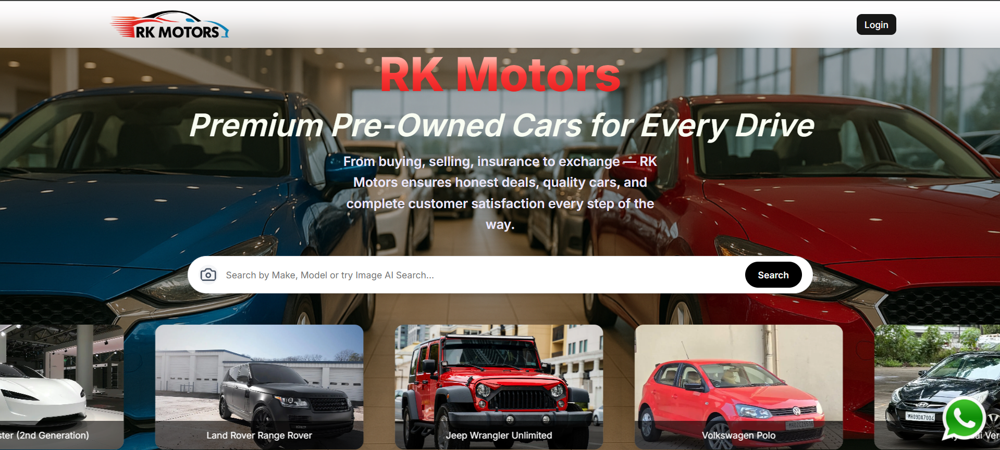</td>
    <td>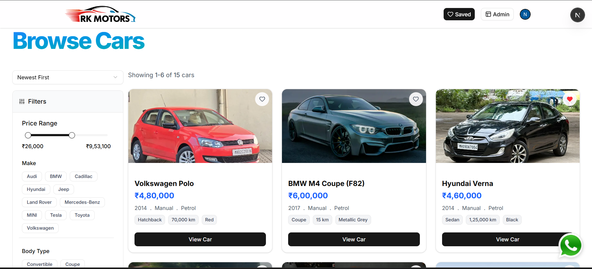</td>
  </tr>

  <tr><td colspan="2" height="30"></td></tr>

  <tr>
    <td align="center"><b>⭐ Highlighted Cars Section</b></td>
    <td align="center"><b>🚘 Car Details & EMI Info</b></td>
  </tr>
  <tr>
    <td>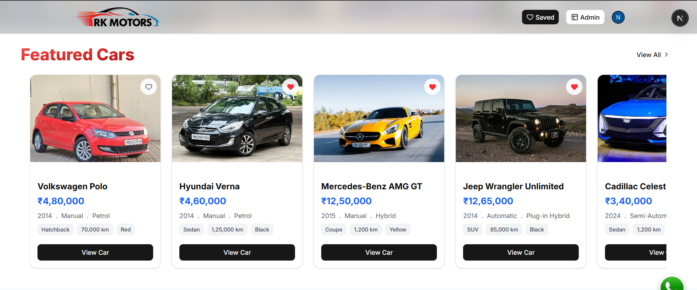</td>
    <td>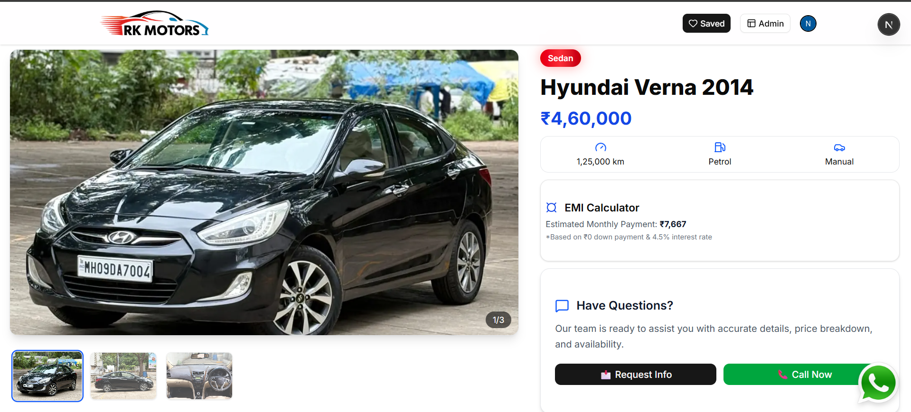</td>
  </tr>

  <tr><td colspan="2" height="30"></td></tr>

  <tr>
    <td align="center"><i><b>🤖 Search Cars via Image (AI)</b></i></td>
    <td align="center"><i><b>❓ FAQ Section</b></i></td>
  </tr>
  <tr>  
    <td>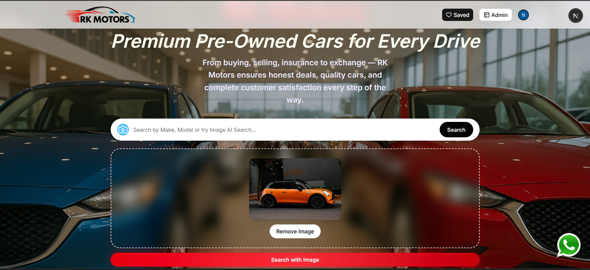</td>
    <td>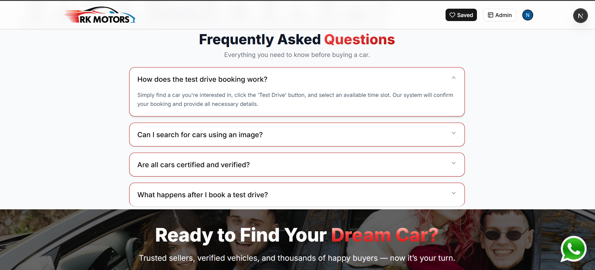</td>
  </tr>

  <tr><td colspan="2" height="30"></td></tr>

  <tr>
    <td align="center"><i><b>🔐 Login / Signup Page</b></i></td>
    <td align="center"><i><b>📊 Admin Dashboard</b></i></td>
  </tr>
  <tr>
    <td>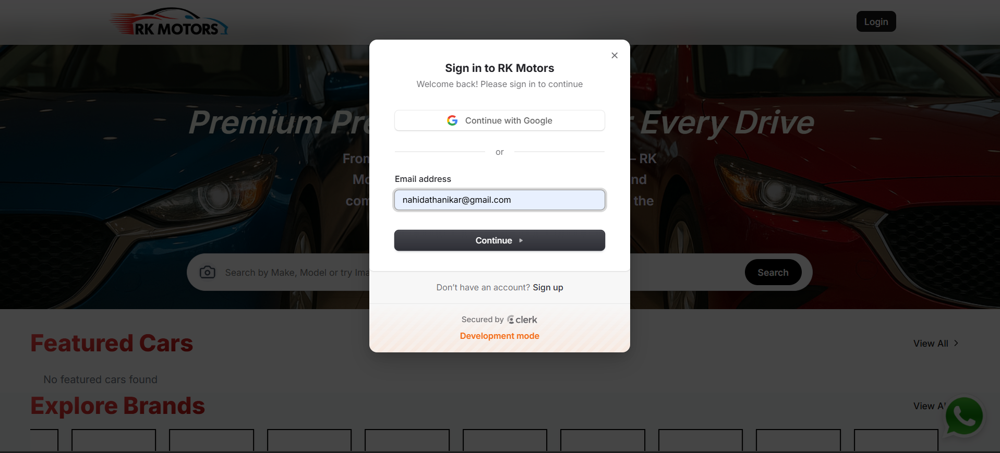</td>
    <td>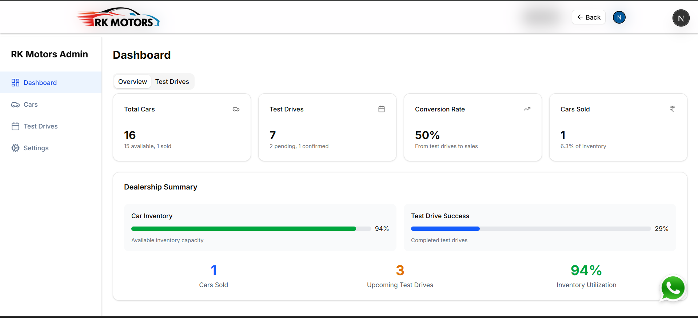</td>
  </tr>

  <tr><td colspan="2" height="30"></td></tr>

  <tr>
    <td align="center"><i><b>➕ Manual Car Entry</b></i></td>
    <td align="center"><i><b>🤖 AI-Based Car Upload</b></i></td>
  </tr>
  <tr>
    <td>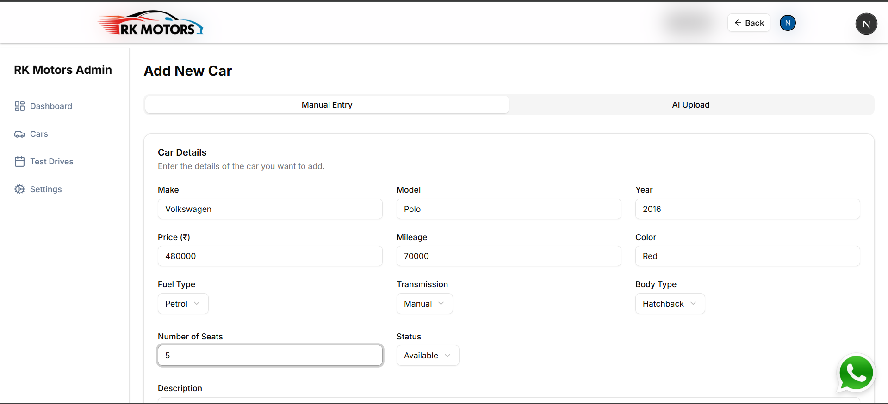</td>
    <td>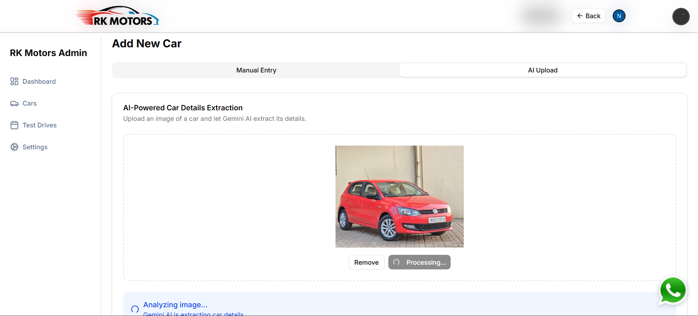</td>
  </tr>

  <tr><td colspan="2" height="30"></td></tr>

  <tr>
    <td align="center"><i><b>🚗 Manage Car Listings</b></i></td>
    <td align="center"><i><b>📅 Manage Test Drive Requests</b></i></td>
  </tr>
  <tr>
    <td>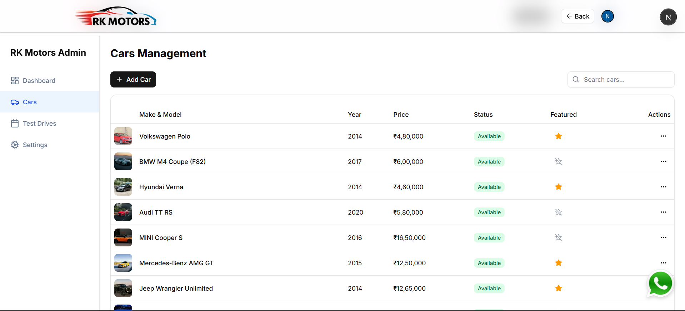</td>
    <td>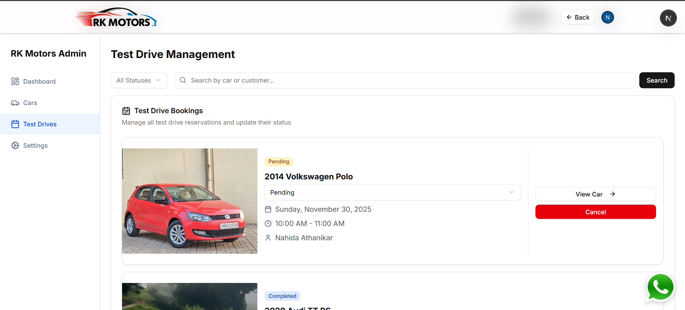</td>
  </tr>
  
</table>


---

## 🛠 Tech Stack
<p align="center">
  
</p>

<p align="center">
  Clerk • Cloudinary • Prisma • Gemini API • WebSockets • WebRTC • Nodemailer • Arcjet
</p>
<table align="center">
  <tr>
    <th>Category</th>
    <th>Tools / Libraries</th>
  </tr>

  <tr>
    <td><b>Frontend</b></td>
    <td>
      <!--  -->
      Next.js, Tailwind CSS, shadCN
    </td>
  </tr>

  <tr>
    <td><b>Backend</b></td>
    <td>
      <!--  -->
      Next.js Server Actions, Node.js
    </td>
  </tr>

  <tr>
    <td><b>Database</b></td>
    <td>
      <!--  -->
      MongoDB, Prisma ORM
    </td>
  </tr>

  <tr>
    <td><b>Authentication</b></td>
    <td>Clerk (Google OAuth, Email/Password)</td>
  </tr>

  <tr>
    <td><b>Image Management</b></td>
    <td>Cloudinary</td>
  </tr>

  <tr>
    <td><b>AI Features</b></td>
    <td>Google Gemini API</td>
  </tr>

  <tr>
    <td><b>Real-Time Communication</b></td>
    <td>WebSockets, WebRTC</td>
  </tr>

  <tr>
    <td><b>Email Service</b></td>
    <td>Nodemailer</td>
  </tr>

  <tr>
    <td><b>Security</b></td>
    <td>Arcjet</td>
  </tr>

  <tr>
    <td><b>Deployment</b></td>
    <td>
      <!--  -->
      Vercel / Render
    </td>
  </tr>

  <tr>
    <td><b>Version Control</b></td>
    <td>
      <!--  -->
      Git & GitHub
    </td>
  </tr>
</table>

---

## 🚀 Key Features Implemented

### 🔐 Authentication & Security
- **User Authentication**
  - Email/Password and Google OAuth via Clerk
  - Protected routes and session management
- **Security & Protection**
  - Rate limiting and bot protection using Arcjet


### 🚗 Car Listings System
- **Full CRUD Functionality**
  - Add, edit, and delete car listings
  - View detailed car information
- **Smart Search & Filters**
  - Partial matching search
  - Dynamic filtering based on user preferences


### 🖼 Image & AI Integration
- **Image Upload System**
  - Secure uploads using Cloudinary
  - Supports both manual and AI-based uploads
- **AI Car Detection**
  - Detect car brand and model using Gemini Vision API
- **Image-to-Search Pipeline**
  - Convert uploaded images into real-time searchable listings


### 💬 Real-Time Communication
- **Chat System**
  - WhatsApp-like real-time messaging using WebSockets
- **Calling Feature**
  - Peer-to-peer calling using WebRTC


### 🤖 AI Features
- **Smart Assistant**
  - Conversational assistant powered by Gemini API
  - Handles user queries intelligently


### 📧 Notifications & Admin
- **Email Notifications**
  - Automated alerts using Nodemailer
- **Admin Panel**
  - Manage listings, AI uploads, and test drive requests


### ⚡ Performance & UI
- **Performance Optimization**
  - Fast backend with Next.js Server Actions
  - Efficient database handling using Prisma ORM
- **Responsive Design**
  - Fully responsive UI with React and Tailwind CSS


### ⚠️ Reliability
- **Error Handling**
  - Graceful handling of API and AI failures
  - Ensures system stability and better user experience
 

---

## Project Structure
```bash
📁 rk-motors/
│
├── 📁 app/                # Pages & routes (Next.js App Router)
├── 📁 components/         # Reusable UI components
├── 📁 actions/            # Server actions (backend logic)
├── 📁 lib/                # DB & utility functions
├── 📁 prisma/             # Database schema (Prisma)
├── 📁 public/             # Images & static assets
├── 📁 services/           # API configs (Gemini, Cloudinary, etc.)
├── 📁 middleware/         # Security (Arcjet)
│
├── middleware.js          # Global middleware
├── next.config.mjs        # Next.js config
├── package.json           # Dependencies
├── .env                   # Environment variables
└── README.md              # Documentation
```
---

## 📊 User Workflow

1. 👉 User signs up or logs in using Email/Password or Google  
2. 🔍 User searches for cars or uploads an image for AI detection  
3. 🤖 System identifies car details using Gemini API  
4. 🚗 Relevant car listings are fetched from the database  
5. 📄 User views detailed car information and pricing  
6. 💬 User interacts via chat, calling, or smart assistant  
7. 📅 User books or requests a test drive  
8. 📧 System sends notifications and updates via email  
9. 🛠️ Admin manages listings, AI uploads, and test drive requests  

---

## 📦 Installation Guide

### 1️⃣ Clone the Repository
```bash
git clone https://github.com/nahida-athanikar/rk-motors.git
cd rk-motors
```
### 2️⃣ Install Dependencies
```bash
npm install
```

### 3️⃣ Add Environment Variables
Create a .env file in the root directory:
```bash
# MongoDB
DATABASE_URL=your_mongodb_connection_string

# Clerk Authentication
NEXT_PUBLIC_CLERK_PUBLISHABLE_KEY=your_clerk_key
CLERK_SECRET_KEY=your_clerk_secret

# Gemini API
GEMINI_API_KEY=your_gemini_api_key

# Cloudinary
CLOUD_NAME=your_cloudinary_cloud_name
CLOUD_API_KEY=your_cloudinary_api_key
CLOUD_API_SECRET=your_cloudinary_api_secret

# Email (Nodemailer)
SMTP_USER=your_email
SMTP_PASS=your_password

# Arcjet Security
ARCJET_KEY=your_arcjet_key
```
#### 👉 Replace all values with your actual credentials.

### 4️⃣ Run the Application
```bash
npm run dev
```

### 5️⃣ Open in Browser
Open your browser and visit:
```bash
http://localhost:3000
```


---

## 🤝 Connect With Me

If you found this project interesting or have any feedback, feel free to connect or reach out.

⭐ If this project helped you, consider giving it a star on GitHub — it truly motivates!

---


